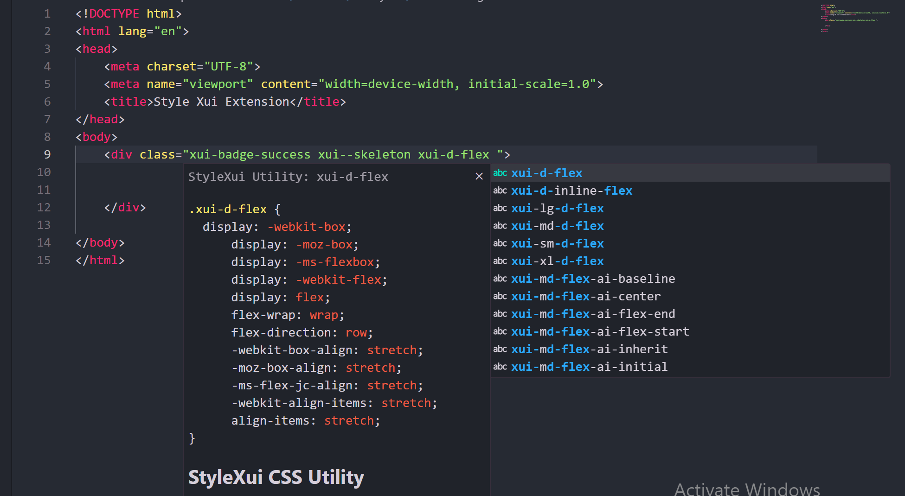

# Stylexui README

This is the README for the extension "stylexui". 

## Overview of StyleXui

Stylexui can also be called Style You.

A lightweight and modern CSS framework crafted to streamline your development process. 

Whether you're a seasoned developer or just starting out, StyleXui equips you with a set of pre-designed components and utilities to enhance your workflow.

Created by Richard Gigi, co-founder of Xnyder, StyleXui was born out of a need to tackle common design inefficiencies in modern web development.

Dive in and discover how StyleXui can help bring your projects to life!

## Features

●	Responsive Design: Built with mobile-first principles, StyleXui ensures your projects look great on all devices.

●	Pre-Built Components: Ready-to-use components like buttons, modals, and navigation bars save you time and effort.

●	Utility-First Approach: A wide range of utility classes makes it easy to style elements without writing custom CSS.
●	Accessibility: StyleXui is designed with accessibility in mind, ensuring your projects are usable by everyone.

<!-- > Tip: Many popular extensions utilize animations. This is an excellent way to show off your extension! We recommend short, focused animations that are easy to follow. -->

## Requirements

Installation methods
1.	Via CDN
The easiest way to include StyleXui in your project is by using the CDN link. Simply add the following <link> tag to your HTML file:

`<link rel="stylesheet"
href="https://cdn.stylexui.com/css/xui.css />`

This method is ideal for:
●	Rapid prototyping
●	Simple HTML projects
●	Minimizing local file dependencies

2.	NPM/Yarn installation
For developers working with frameworks like React, Vue, or Angular, installing StyleXui via NPM or Yarn provides better version control and flexibility.

a.	Install via NPM
`npm install @richaadgigi/stylexui`

b.	Install via Yarn
`yarn add @richaadgigi/stylexui`

After installation, import StyleXui into your project:
import '@richaadgigi/stylexui';
This approach is suitable for:
●	Component-based frameworks
●	Scalable projects with build tools
●	Managing dependencies effectively

3.	Manual download (ZIP files)
For offline use or when package managers are not an option, you can download the framework manually. 
a.	Download the latest version from the official [git](https://github.com/richaadgigi/stylexui.git). 
b.	Extract the files and link the CSS in your HTML file:
`<link rel="stylesheet" href="path/to/xui.css" />`

Manual installation works best for:
●	Static HTML/CSS projects
●	Legacy systems without modern tooling
●	Custom hosting needs

## HTML Boilerplate with the Framework

### Basic Setup
Copy and paste the following HTML template to get started:

    <!DOCTYPE html> 
    <html lang="en">
    <head>
        <meta charset="UTF-8">
        <meta name="viewport" content="width=device-width,  initial-scale=1.0">
        <title>My StyleXui Project</title>
        <link rel="stylesheet" href="path/to/xui.css"> 
    </head>

    <body>
        

            <h1>Welcome to StyleXui</h1>
            
Build modern, responsive, and accessible UIs with ease.

            <button class="xui-btn xui-btn-primary">Get Started</button>
        

    </body>
    </html>

## Release Notes

### 0.0.1

Initial release of Stylexui Extension...

## License

### License Information

XUI is an open-source front-end framework designed to provide lightweight and customizable UI components. It is distributed under the MIT License, ensuring flexibility for both personal and commercial use.

License Type: MIT License

XUI v1.1.0 is licensed under the MIT License (Massachusetts Institute of Technology License).

Key Terms of the MIT License
●	Permitted Uses
○	Personal, commercial, and enterprise applications
○	Modification, distribution, and sublicensing
○	Integration into open-source and proprietary projects
●	Restrictions
○	No warranty or liability for any damages
○	Cannot hold the original authors liable for any issues
○	Must retain copyright notices in any distribution

Third-Party Dependencies
XUI utilizes `normalize.css v3.0.1`, a CSS reset stylesheet that ensures consistent styling across different browsers. Normalize.css is also licensed under the MIT License and can be freely used in any project.
Compliance and Usage

By using XUI, you agree to the terms set by the MIT License. Users are encouraged to contribute to the project while respecting the license terms.
For full licensing details, refer to the MIT License documentation.
 

## For more information

* [Stylexui Support](https://stylexui.com)

>Don't forget to star the [repository](https://github.com/richaadgigi/stylexui.git) and follow the organization.

**Enjoy!**
